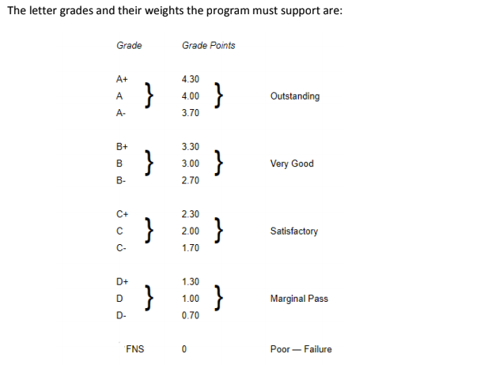
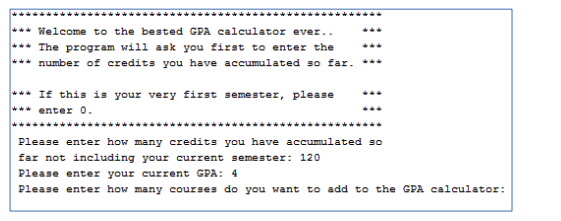
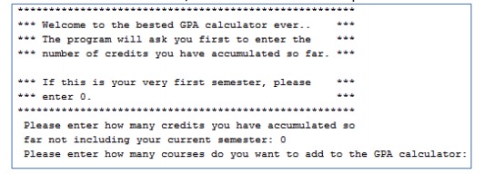

# COMP248_A3-Q1

It is quite common at that time of the semester where you start speculating what grade you are going to get in a particular course and how that grade will affect your GPA. This assignment will help you and your friends to do just that. In this assignment, you will create a GPA calculator for an undergraduate Concordia student.  

  
The program will start by asking the user about his/her current GPA and the number of credits he/she
has accumulated so far.  

  
If the student is a new student, then he/she will enter 0 for the number of credits and the program will
NOT ask the student about his/her current GPA since that question would be considered useless.  

  
Here you are an example of a run with all valid data:  
The program, will display the above menu, once it has gotten: 
1. the total number of credits the student has achieved so far 
2. the student’s current GPA 
3. The courses the student is currently taking. These are the courses the student wants to check 
their effect on his/her GPA 
- option 1: 
to display the info given to the program  
- option 2: 
to calculate and display the new GPA 
The calculation formula for the new GPA is as follows: 
x = (current GPA * total number of credits achieved so far) + ∑ (weight of grade *course credit) for all
current courses) 
y = total number of credits achieved so far + ∑ (course credit) for all current courses 
New GPA = x/y 
For example, for the above example 
x= (4.0*120) + (4*3) + (3*3) + (4*3) = 513 
y= 120 + 3 + 3 + 3 = 129 
New GPA = 513/129 = 3.976  
- option 3: 
a list of the current courses will be listed and the user will be asked to choose the course number of the course to be deleted. 
After the deletion of some course, the GPA needs to be recalculated  
- option 4: 
is used to add a course 
After the addition of some course, the GPA needs to be recalculated  
- option 5: 
will make the program terminate.  
Validation to be done: 
1. Number of credits accumulated so far must be greater than or equal to 0; it can not be a negative
number 
2. Current GPA has to be between 0 to 4.3 inclusive 
3. Number of courses to add to the system has to be greater than 0 
4. Number of credits of a course has to be greater than 0 
5. Letter grade has to be a valid one 
6. The chosen menu option has to be between 1 and 5 inclusive 
